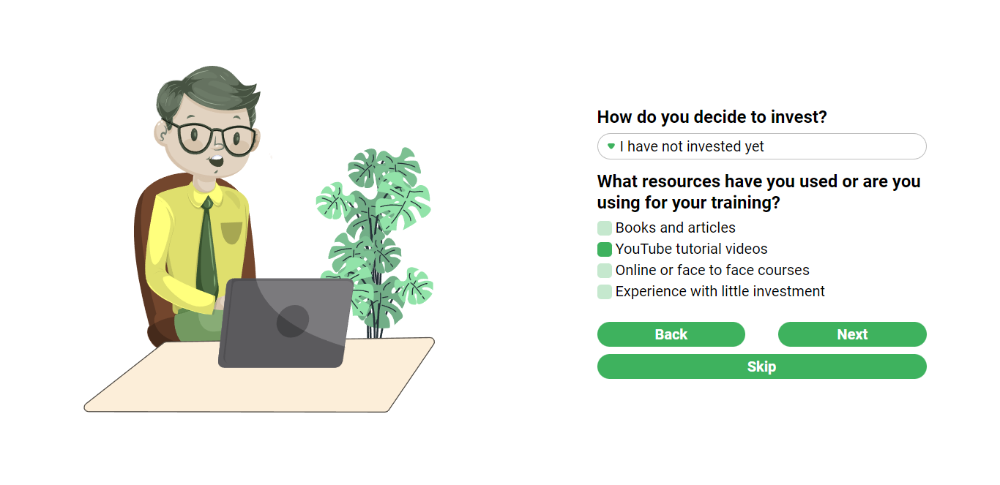
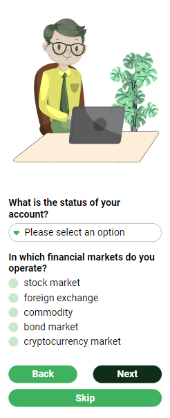
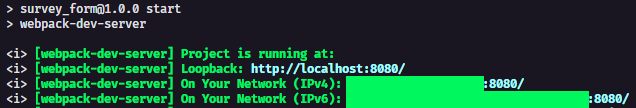

# 1º DESAFIO PB AWS REACT - Survey Form

> Survey form for investments

## Specifications

---

### Technologies

- HTML
- CSS
- JavaScript
- TypeScript

### Functionalities

- Thanks/success page
- Responsive design
- Custom navigation
- Information saved in <i>localStorage</i>
- Validation of fields in the form

## Demonstration

---





## Development Setup

---

Step 1
Clone repository:

```bash
git clone https://github.com/davitorress/survey_form.git
```

Step 2
Install dependencies and start application server:

```bash
npm install
npm start
```

Step 3
Opening application:

In the command terminal it will show the access links to the project, by default it is localhost on port 8080


